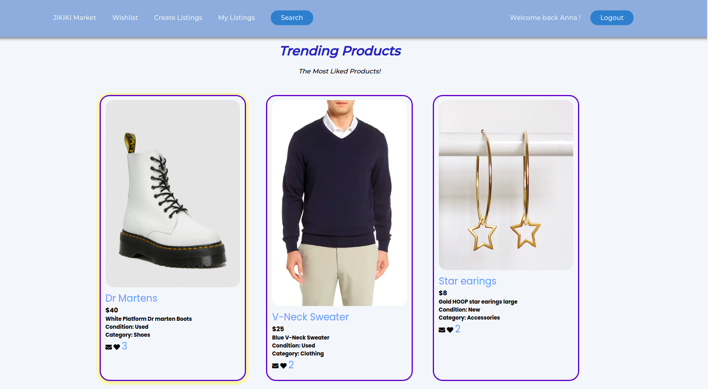
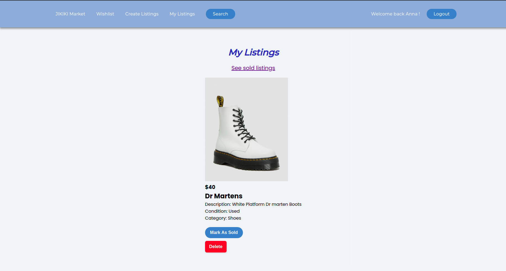
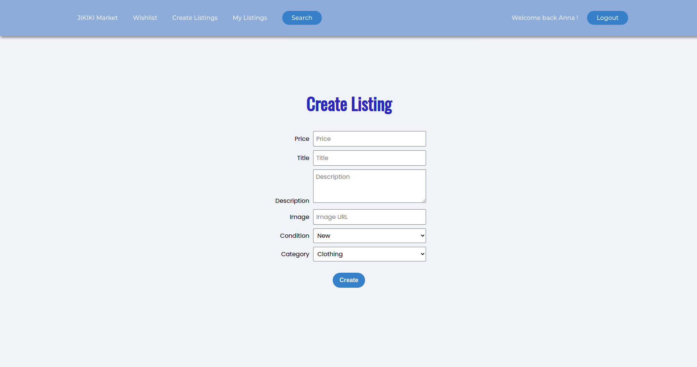

LHL Node Skeleton
=========

## Project Setup

The following steps are only for _one_ of the group members to perform.

1. Create your own copy of this repo using the `Use This Template` button, ideally using the name of your project. The repo should be marked Public
2. Verify that the skeleton code now shows up in your repo on GitHub, you should be automatically redirected
3. Clone your copy of the repo to your dev machine
4. Add your team members as collaborators to the project so that they can push to this repo
5. Let your team members know the repo URL so that they use the same repo (they should _not_ create a copy/fork of this repo since that will add additional workflow complexity to the project)

## ERD

- / - home page - trending listings are shown at the top, which are the most liked listings. Below that the full list of listings is shown. Listings can be liked by users. The creator of the post can be contacted by clicking the mail icon
- /new-listing - create a new listing and add it to my listings
- /my-listings - shows listings you created with options to mark your listings as sold and/or delete them
- /sold-listings - shows listings you created and are sold
- /search - fill in the search form to filter listings
- /api/search-listings - shows the filtered listings from your search 
- /login - login to the app
- /my-wishlist - the listings you have liked

## Home page and Trending section

## My Listings

## Create Form

## Getting Started

1. Create the `.env` by using `.env.example` as a reference: `cp .env.example .env`
2. Update the .env file with your correct local information 
  - username: `labber` 
  - password: `labber` 
  - database: `midterm`
3. Install dependencies: `npm i`
4. Fix to binaries for sass: `npm rebuild node-sass`
5. Reset database: `npm run db:reset`
  - Check the db folder to see what gets created and seeded in the SDB
7. Run the server: `npm run local`
  - Note: nodemon is used, so you should not have to restart your server
8. Visit `http://localhost:8080/`

## Warnings & Tips

- Do not edit the `layout.css` file directly, it is auto-generated by `layout.scss`
- Split routes into their own resource-based file names, as demonstrated with `users.js` and `widgets.js`
- Split database schema (table definitions) and seeds (inserts) into separate files, one per table. See `db` folder for pre-populated examples. 
- Use the `npm run db:reset` command each time there is a change to the database schema or seeds. 
  - It runs through each of the files, in order, and executes them against the database. 
  - Note: you will lose all newly created (test) data each time this is run, since the schema files will tend to `DROP` the tables and recreate them.

## Dependencies

- Node 10.x or above
- NPM 5.x or above
- PG 6.x
